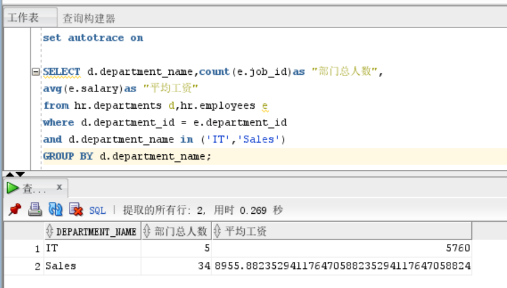
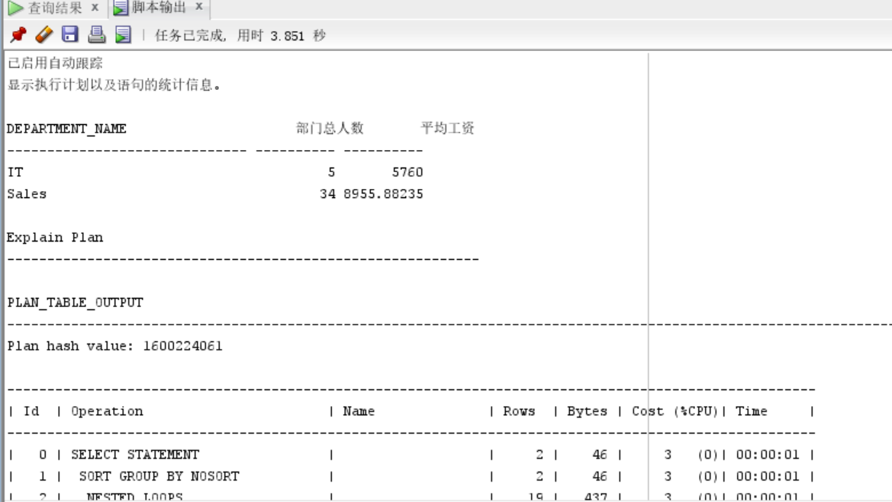
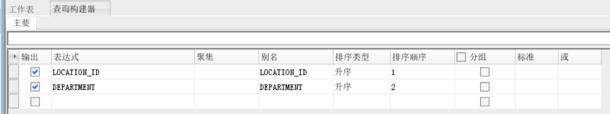
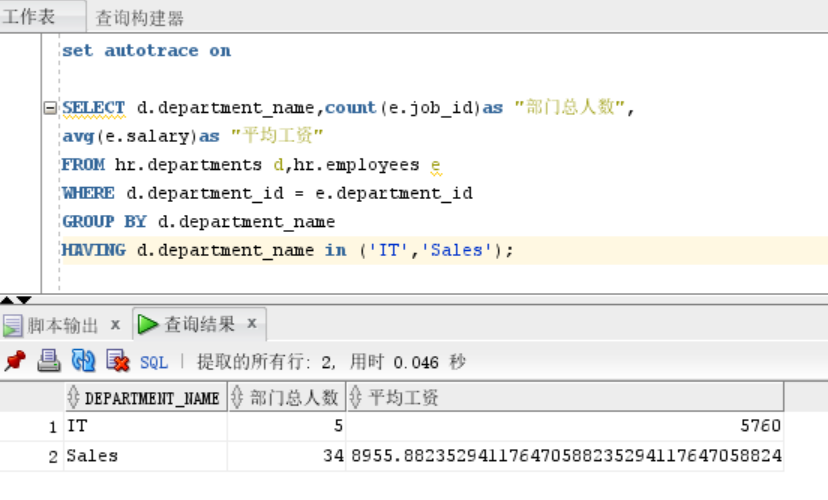
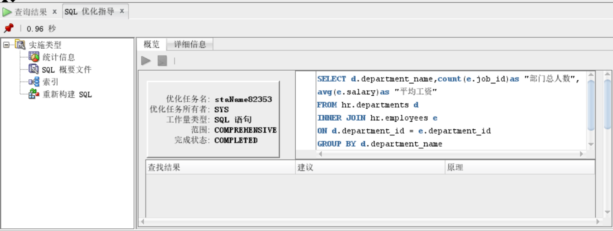

## 实验1：SQL语句的执行计划分析与优化指导
### 1.实验目的
分析SQL执行计划，执行SQL语句的优化指导。理解分析SQL语句的执行计划的重要作用。
### 2.实验内容
- 对Oracle12c中的HR人力资源管理系统中的表进行查询与分析。
- 首先运行和分析教材中的样例：本训练任务目的是查询两个部门('IT'和'Sales')的部门总人数和平均工资，以下两个查询的结果是一样的。但效率不相同。
- 设计自己的查询语句，并作相应的分析，查询语句不能太简单。
### 3.实验步骤
对Oracle12c中的HR人力资源管理系统中的表查询分析：

#### (1)教材查询语句一:
```sql
set autotrace on

SELECT d.department_name,count(e.job_id)as "部门总人数",
avg(e.salary)as "平均工资"
from hr.departments d,hr.employees e
where d.department_id = e.department_id
and d.department_name in ('IT','Sales')
GROUP BY d.department_name;
```
##### 分析：
从hr.departments d,hr.employees e两个表中，筛选出符合d.department_id = e.department_id and d.department_name in ('IT','Sales')的数据，再根据d.department_name分组，从组中搜索d.department_name,count(e.job_id)as "部门总人数",avg(e.salary)as "平均工资"。
##### 运行结果如下：

##### 优化指导：

#### (2)教材查询语句二:
```sql
set autotrace on

SELECT d.department_name,count(e.job_id)as "部门总人数",
avg(e.salary)as "平均工资"
FROM hr.departments d,hr.employees e
WHERE d.department_id = e.department_id
GROUP BY d.department_name
HAVING d.department_name in ('IT','Sales');
```
##### 分析：
从hr.departments d,hr.employees e两个表中，筛选出符合d.department_id = e.department_id的数据，再根据d.department_name分组，从组中筛选出符合d.department_name in ('IT','Sales')的数据，从中搜索d.department_name,count(e.job_id)as "部门总人数",avg(e.salary)as "平均工资"。
##### 运行结果如下：

##### 优化指导：

#### (3)对语句二进行优化：
通过运行结果得知，语句二要比语句一效率高。语句二与语句一最大的区别在于，在分组的后通过having筛选出了符合d.department_name in ('IT','Sales')的对象，而语句一是在分组前再通过where进行筛选的。语句一在筛选符合d.department_name in ('IT','Sales')的数据的筛选量比语句二的筛选量大，则效率不必语句二高。所以可得语句二的优化：
```sql
SELECT d.department_name,count(e.job_id)as "部门总人数",
avg(e.salary)as "平均工资"
FROM hr.departments d
INNER JOIN hr.employees e
ON d.department_id = e.department_id
GROUP BY d.department_name
HAVING d.department_name in ('IT','Sales'); 
```
##### 分析：
将hr.departments d表与hr.employees e通过d.department_id = e.department_id关联，再从关联后的表根据d.department_name分组，筛选出d.department_name in ('IT','Sales')的数据，从中搜索d.department_name,count(e.job_id)as "部门总人数",avg(e.salary)as "平均工资"。
##### 运行结果如下：

##### 优化指导：
