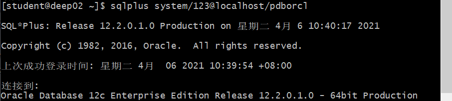
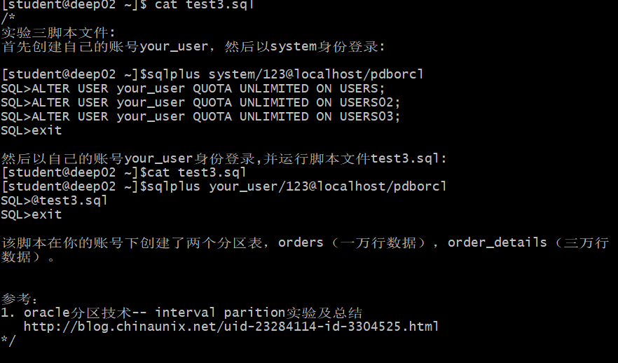
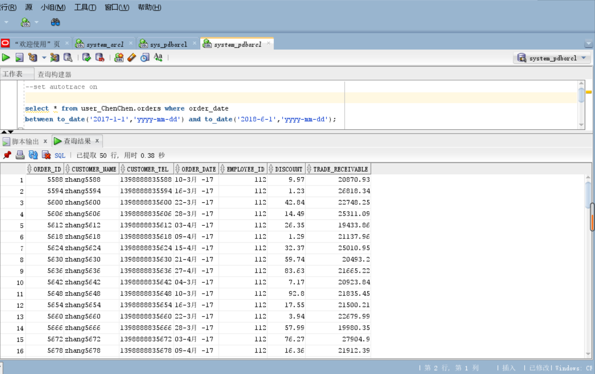
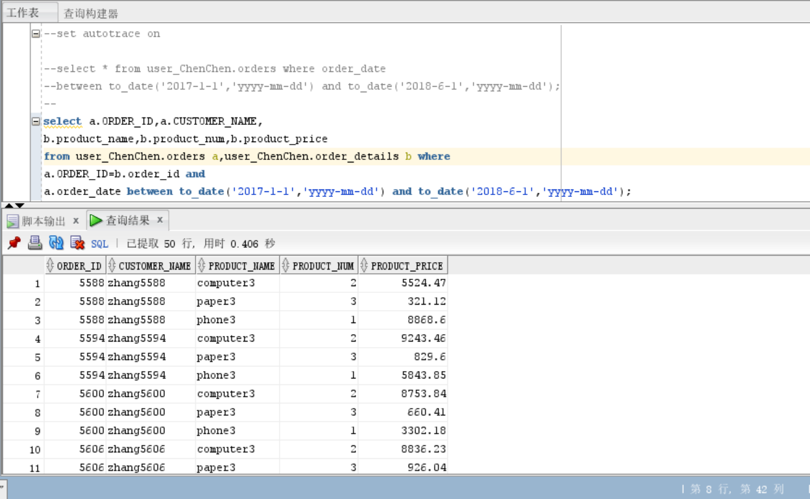
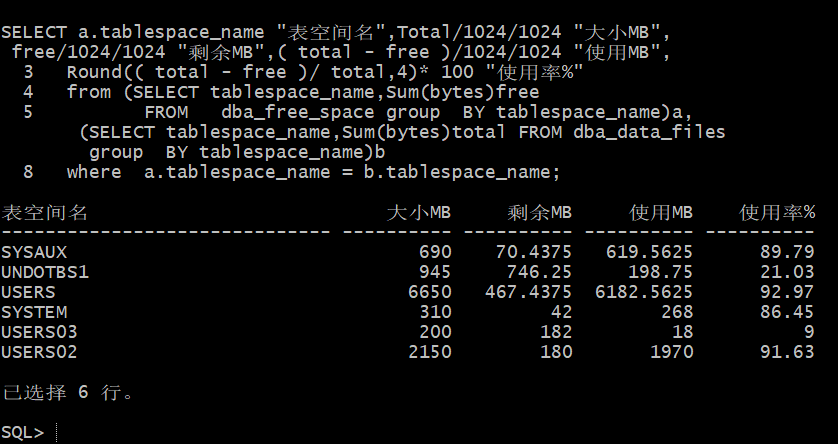

## 实验3：创建分区表
### 实验目的
掌握分区表的创建方法，掌握各种分区方式的使用场景。
### 实验内容
- 本实验使用3个表空间：USERS,USERS02,USERS03。在表空间中创建两张表：订单表(orders)与订单详表(order_details)。
- 使用你自己的账号创建本实验的表，表创建在上述3个分区，自定义分区策略。
- 你需要使用system用户给你自己的账号分配上述分区的使用权限。你需要使用system用户给你的用户分配可以查询执行计划的权限。
- 表创建成功后，插入数据，数据能并平均分布到各个分区。每个表的数据都应该大于1万行，对表进行联合查询。
- 写出插入数据的语句和查询数据的语句，并分析语句的执行计划。
- 进行分区与不分区的对比实验。
### 实验步骤
#### 首先创建自己的账号your_user，然后以system身份登录:
```sql
[student@deep02 ~]$sqlplus system/123@localhost/pdborcl
SQL>ALTER USER your_user QUOTA UNLIMITED ON USERS;
SQL>ALTER USER your_user QUOTA UNLIMITED ON USERS02;
SQL>ALTER USER your_user QUOTA UNLIMITED ON USERS03;
SQL>exit
```
- 运行结果：




#### 然后以自己的账号your_user身份登录,并运行脚本文件test3.sql:
```sql
[student@deep02 ~]$cat test3.sql
[student@deep02 ~]$sqlplus your_user/123@localhost/pdborcl
SQL>@test3.sql
SQL>exit
```
- 运行结果：




#### 以system用户运行：
```sql
set autotrace on

select * from your_user.orders where order_date
between to_date('2017-1-1','yyyy-mm-dd') and to_date('2018-6-1','yyyy-mm-dd');

select a.ORDER_ID,a.CUSTOMER_NAME,
b.product_name,b.product_num,b.product_price
from your_user.orders a,your_user.order_details b where
a.ORDER_ID=b.order_id and
a.order_date between to_date('2017-1-1','yyyy-mm-dd') and to_date('2018-6-1','yyyy-mm-dd');
```
- 运行结果：



#### 查看数据库的使用情况
```sql
SQL>SELECT tablespace_name,FILE_NAME,BYTES/1024/1024 MB,MAXBYTES/1024/1024 MAX_MB,autoextensible FROM dba_data_files  WHERE  tablespace_name='USERS';

SQL>SELECT a.tablespace_name "表空间名",Total/1024/1024 "大小MB",
 free/1024/1024 "剩余MB",( total - free )/1024/1024 "使用MB",
 Round(( total - free )/ total,4)* 100 "使用率%"
 from (SELECT tablespace_name,Sum(bytes)free
        FROM   dba_free_space group  BY tablespace_name)a,
       (SELECT tablespace_name,Sum(bytes)total FROM dba_data_files
        group  BY tablespace_name)b
 where  a.tablespace_name = b.tablespace_name;
```

