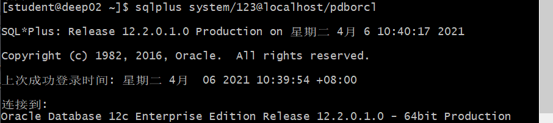
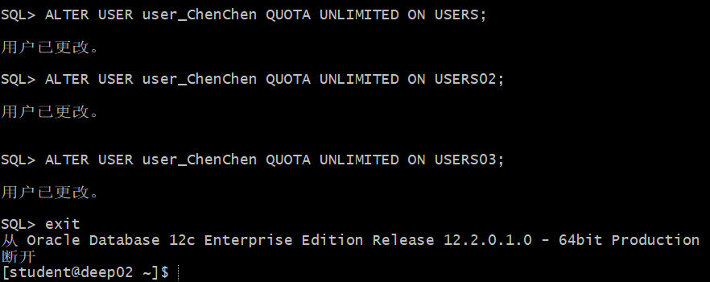
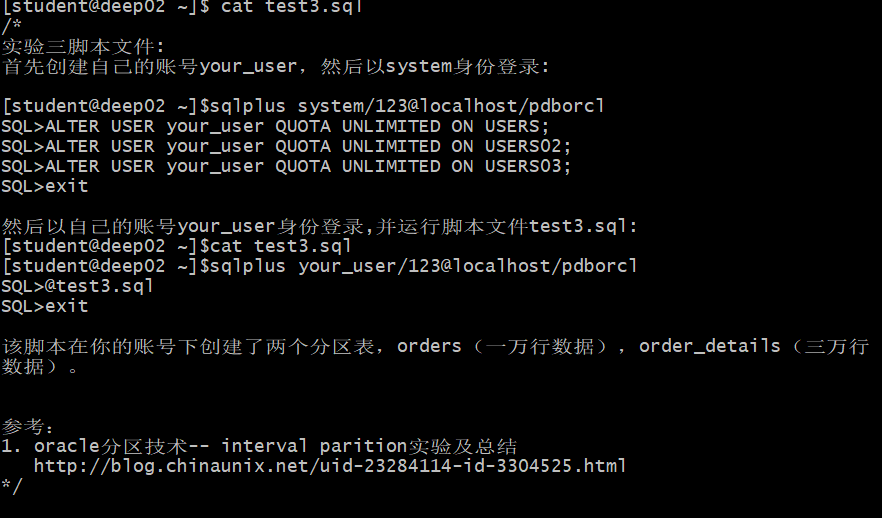
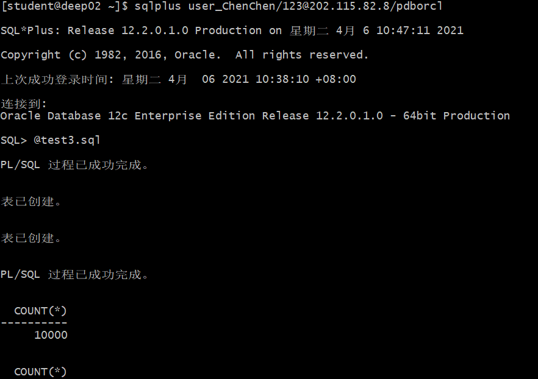
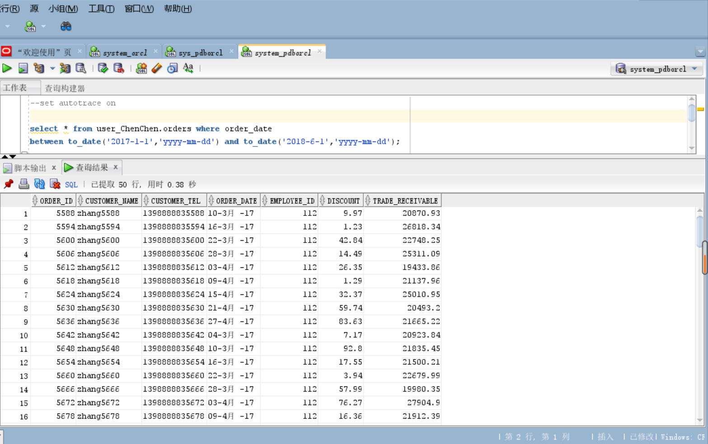
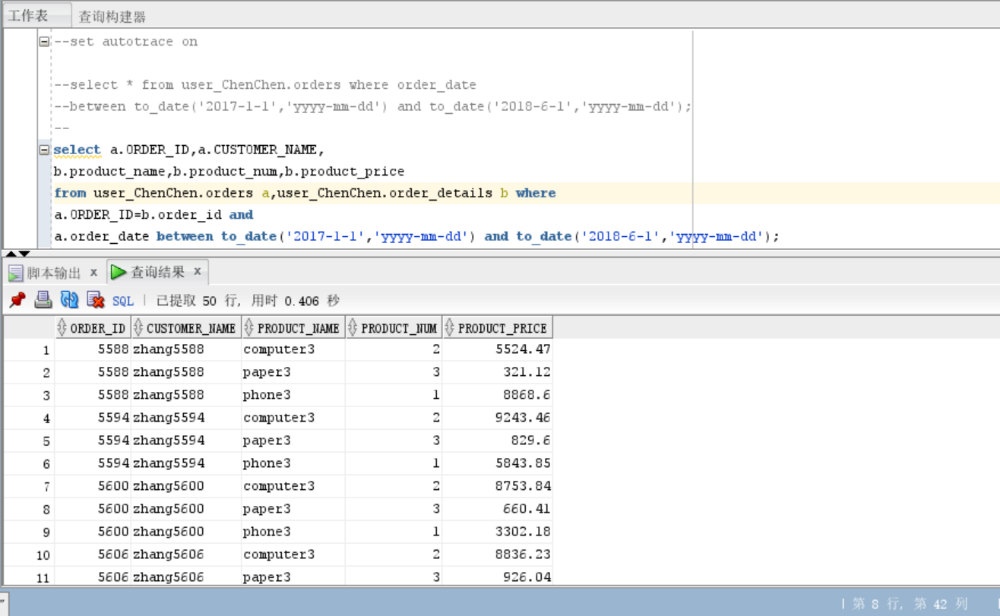

#### 首先创建自己的账号your_user，然后以system身份登录:
```sql
[student@deep02 ~]$sqlplus system/123@localhost/pdborcl
SQL>ALTER USER your_user QUOTA UNLIMITED ON USERS;
SQL>ALTER USER your_user QUOTA UNLIMITED ON USERS02;
SQL>ALTER USER your_user QUOTA UNLIMITED ON USERS03;
SQL>exit
```
- 运行结果：




#### 然后以自己的账号your_user身份登录,并运行脚本文件test3.sql:
```sql
[student@deep02 ~]$cat test3.sql
[student@deep02 ~]$sqlplus your_user/123@localhost/pdborcl
SQL>@test3.sql
SQL>exit
```
- 运行结果：




#### 以system用户运行：
```sql
set autotrace on

select * from your_user.orders where order_date
between to_date('2017-1-1','yyyy-mm-dd') and to_date('2018-6-1','yyyy-mm-dd');

select a.ORDER_ID,a.CUSTOMER_NAME,
b.product_name,b.product_num,b.product_price
from your_user.orders a,your_user.order_details b where
a.ORDER_ID=b.order_id and
a.order_date between to_date('2017-1-1','yyyy-mm-dd') and to_date('2018-6-1','yyyy-mm-dd');
```
- 运行结果：



